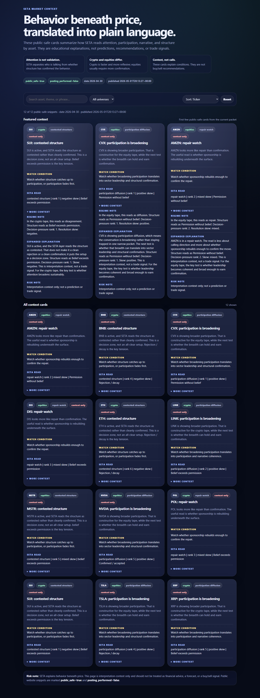
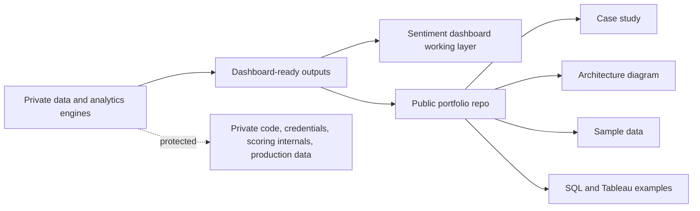

# Sentiment Analytics Dashboard

A recruiter-friendly portfolio case study showing how social sentiment, public attention, market context, SQL reporting, and Tableau-style dashboards can be organized into a clear analytics product.

This repo is the public showcase layer of a larger private SETA analytics system. It is designed to be understandable in a few minutes without exposing the private engines, source adapters, scoring internals, model code, or production data.


## Dashboard preview


This dashboard view shows the public-facing SETA interface: asset controls, Market Radar, narrative briefing cards, structure score, signal state, and sentiment-enhanced technical charting.

## 60-second overview

**What it is:** a sentiment analytics dashboard portfolio for explaining market narrative and engagement patterns.

**Why it matters:** public discussion around financial assets is noisy. This project shows how sentiment, attention, and market context can be structured into repeatable reporting outputs instead of scattered commentary.

**What I built:** the public-facing portfolio layer: dashboard methodology, sample reporting data, SQL examples, Tableau calculation notes, architecture documentation, model-validation concepts, and public/private repo boundaries.

**Who it is for:** recruiters, hiring managers, finance/accounting leaders, analytics managers, and technical reviewers.

**Main takeaway:** this project demonstrates data storytelling, SQL reporting, dashboard design, analytics governance, and product judgment around what should be public versus private.

## Business value

This project demonstrates how messy, unstructured information can be transformed into structured reporting outputs for dashboard users. The same workflow principles apply directly to accounting, finance, FP&A, revenue analytics, KPI reporting, and executive dashboards: collect scattered data, structure it, validate it, and present it clearly.

For a business audience, the project is less about market prediction and more about decision-support design: turning noisy inputs into readable context, creating repeatable reporting layers, and separating public-facing summaries from private production systems.

## Tech stack represented

| Area | Tools / concepts |
| --- | --- |
| Analytics workflow | Python, structured pipeline design, feature and output contracts |
| Data layer | SQL, PostgreSQL-style reporting tables, sanitized sample data |
| Visualization | Tableau-oriented calculated fields, dashboard design, context cards |
| Modeling governance | validation concepts, confidence bands, challenger evaluation, freshness checks |
| Communication | public-safe summaries, recruiter-facing documentation, architecture diagrams |

## Visual showcase

The architecture visual above gives reviewers an immediate orientation to the public/private project boundary.

Dashboard screenshots are reviewed before publication. The current repo includes a modern desktop dashboard preview and a mobile QA preview.

### Mobile dashboard preview


This mobile QA screenshot shows that the dashboard was reviewed for smaller-screen presentation, supporting the project's broader goal of making sentiment analytics usable beyond a desktop-only workflow.

Additional visual candidates, such as market context panels or earlier dashboard prototypes, are tracked in [`screenshots/README.md`](screenshots/README.md).


### Market context preview



This market context view shows how the dashboard translates broader market conditions into public-safe explanatory cards, helping users interpret sentiment and attention within a larger market backdrop.

## Architecture at a glance



The design principle is simple:

> The public repo shows the what, why, and dashboard-facing outputs. The private repos keep the how.

## Best first read

For an external reviewer, start here:

1. [`docs/project_portfolio_case_study.md`](docs/project_portfolio_case_study.md) - full case-study narrative
2. [`architecture/public_architecture_diagram.md`](architecture/public_architecture_diagram.md) - architecture and public/private boundary
3. [`docs/recruiter_talking_points.md`](docs/recruiter_talking_points.md) - resume/interview positioning
4. [`docs/dashboard_visual_evolution.md`](docs/dashboard_visual_evolution.md) - visual development notes
5. [`sample_data/`](sample_data/) and [`sql_examples/`](sql_examples/) - sanitized examples
6. [`tableau_notes/calculated_fields.md`](tableau_notes/calculated_fields.md) - dashboard implementation notes

## What is public here

This repository includes:

- a polished portfolio case study
- public-safe architecture documentation
- sanitized sample CSVs
- simplified SQL reporting examples
- Tableau calculated-field notes
- model-validation and dashboard handoff concepts
- recruiter-facing talking points
- reviewed dashboard screenshots

## What stays private

The production SETA engines are intentionally not included. Protected components include:

- ingestion and source-adapter code
- credentials and connection details
- orchestration and scheduler logic
- proprietary scoring and weighting internals
- production database structures
- model training code and artifacts
- live data and commercial workflow details

## Relationship to the broader project

This public repo is a companion to the broader SETA system.

- `sentiment-dash` is the working dashboard source.
- `SETA_engine` is the private analytics and data-quality layer.
- `SETA_Prediction_Intelligence_Engine` is the private model-validation and dashboard-context layer.
- `Sentiment-Analytics-Dashboard` is the polished public portfolio layer.

## Repository map

<details>
<summary>View full repository structure</summary>

```text
Sentiment-Analytics-Dashboard/
|-- README.md
|-- assets/
|   |-- README.md
|   `-- public_architecture_overview.svg
|-- architecture/
|   |-- public_architecture_diagram.md
|   `-- public_portfolio_architecture.md
|-- docs/
|   |-- analytics_framework_glossary.md
|   |-- dashboard_handoff_contract_concept.md
|   |-- dashboard_methodology.md
|   |-- dashboard_visual_evolution.md
|   |-- data_dictionary_sanitized.md
|   |-- model_validation_principles.md
|   |-- prediction_intelligence_public_summary.md
|   |-- private_engine_boundary.md
|   |-- project_portfolio_case_study.md
|   |-- public_safe_output_contract.md
|   |-- recruiter_talking_points.md
|   |-- seta_engine_public_summary.md
|   `-- source_selection_log.md
|-- sample_data/
|   |-- sample_asset_metrics.csv
|   `-- sample_sentiment_scores.csv
|-- screenshots/
|   |-- README.md
|   |-- dashboard_overview_public.png
|   |-- market_context_public.png
|   `-- mobile_dashboard_public.png
|-- sql_examples/
|   `-- sentiment_dashboard_rollup_sample.sql
`-- tableau_notes/
    `-- calculated_fields.md
```

</details>

## Professional summary

This project demonstrates the ability to turn ambiguous, noisy, multi-source information into a structured reporting product. It combines accounting discipline, analytics engineering, SQL reporting, dashboard design, validation thinking, and clear communication for non-technical stakeholders.

## Public repo QA

Run the lightweight public-portfolio contract check before publishing documentation or screenshot updates:

```bash
python scripts/check_public_repo_contract.py
```

This check validates local Markdown links and image references, confirms sanitized sample-data fields are documented, checks the public methodology field contract, and scans for obvious credential-style literals.

## Reviewer path

For a quick review, start with the dashboard screenshots and 60-second overview. For a deeper technical review, follow the architecture diagram, case study, sanitized data dictionary, SQL sample, and Tableau calculation notes.

Recommended flow:

1. Review the dashboard preview to understand the product surface.
2. Read the 60-second overview for business context.
3. Open the architecture diagram to understand the public/private boundary.
4. Review the sanitized sample data and SQL rollup example.
5. Read the model-validation and public-safe output notes for governance context.
