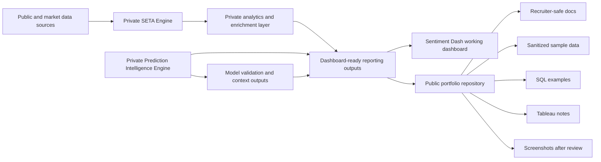
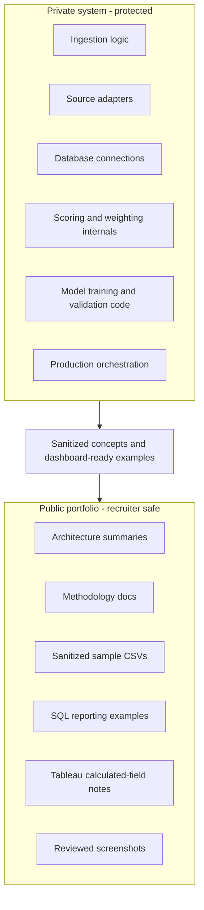
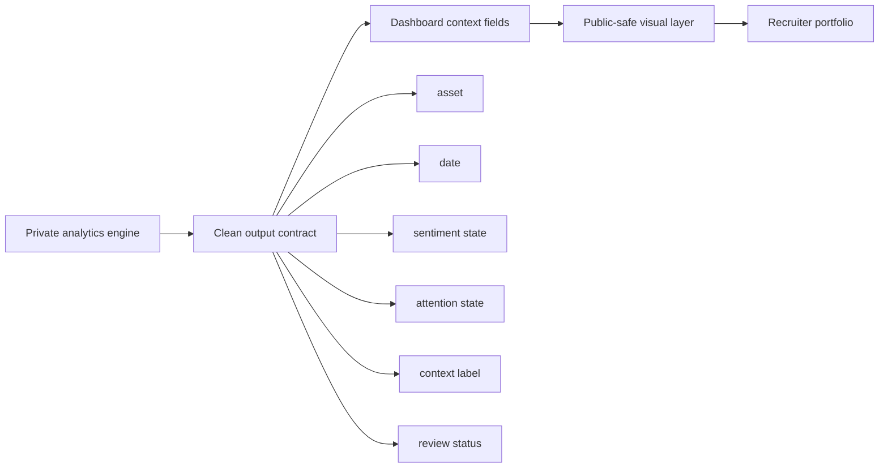

# Public Architecture Diagram

## Purpose

This diagram explains the public/private architecture boundary for the Sentiment Analytics Dashboard portfolio.

The public repository is designed to show the reporting surface, methodology, sample data, and recruiter-safe documentation. The private repositories keep ingestion, scoring, orchestration, validation, and production infrastructure protected.

## High-level architecture

## Public/private boundary

## Dashboard handoff concept

## Design principle

> The private system can be complex. The public portfolio should be clear.

## Reviewer takeaway

This architecture demonstrates separation of concerns:

- private engines perform the complex work
- reporting outputs create stable dashboard handoffs
- public documentation explains the system safely
- recruiters can evaluate skill without seeing proprietary internals
